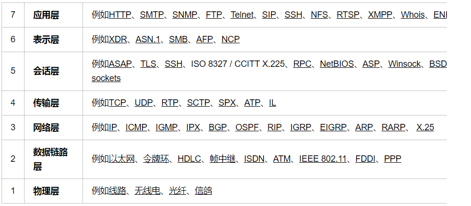

# 1. http、TCP/IP协议与socket之间的区别
下面的图表试图显示不同的TCP/IP和其他的协议在最初OSI模型中的位置：

# 2. TCP/IP连接

手机能够使用联网功能是因为手机底层实现了TCP/IP协议，可以使手机终端通过无线网络建立TCP连接。TCP协议可以对上层网络提供接口，使上层网络数据的传输建立在“无差别”的网络之上。

## 2.1 建立通信链路

当客户端要与服务端通信，客户端首先要创建一个 Socket 实例，操作系统将为这个 Socket 实例分配一个没有被使用的本地端口号，并创建一个包含本地和远程地址和端口号的套接字数据结构，这个数据结构将一直保存在系统中直到这个连接关闭。在创建 Socket 实例的构造函数正确返回之前，将要进行 TCP 的三次握手协议，TCP 握手协议完成后，Socket 实例对象将创建完成，否则将抛出 IOException 错误。

与之对应的服务端将创建一个 ServerSocket 实例，ServerSocket 创建比较简单只要指定的端口号没有被占用，一般实例创建都会成功，同时操作系统也会为 ServerSocket 实例创建一个底层数据结构，这个数据结构中包含指定监听的端口号和包含监听地址的通配符，通常情况下都是“*”即监听所有地址。之后当调用 accept() 方法时，将进入阻塞状态，等待客户端的请求。当一个新的请求到来时，将为这个连接创建一个新的套接字数据结构，该套接字数据的信息包含的地址和端口信息正是请求源地址和端口。这个新创建的数据结构将会关联到 ServerSocket 实例的一个未完成的连接数据结构列表中，注意这时服务端与之对应的 Socket 实例并没有完成创建，而要等到与客户端的三次握手完成后，这个服务端的 Socket 实例才会返回，并将这个 Socket 实例对应的数据结构从未完成列表中移到已完成列表中。所以 ServerSocket 所关联的列表中每个数据结构，都代表与一个客户端的建立的 TCP 连接。

## 2.2 数据传输

传输数据是我们建立连接的主要目的，如何通过 Socket 传输数据，下面将详细介绍。 
当连接已经建立成功，服务端和客户端都会拥有一个 Socket 实例，每个 Socket 实例都有一个 InputStream 和 OutputStream，正是通过这两个对象来交换数据。同时我们也知道网络 I/O 都是以字节流传输的。当 Socket 对象创建时，操作系统将会为 InputStream 和 OutputStream 分别分配一定大小的缓冲区，数据的写入和读取都是通过这个缓存区完成的。

写入端将数据写到 OutputStream 对应的 SendQ 队列中，当队列填满时，数据将被发送到另一端 InputStream 的 RecvQ 队列中，如果这时 RecvQ 已经满了，那么 OutputStream 的 write 方法将会阻塞直到 RecvQ 队列有足够的空间容纳 SendQ 发送的数据。值得特别注意的是，这个缓存区的大小以及写入端的速度和读取端的速度非常影响这个连接的数据传输效率，由于可能会发生阻塞，所以网络 I/O 与磁盘 I/O 在数据的写入和读取还要有一个协调的过程，如果两边同时传送数据时可能会产生死锁，在后面 NIO 部分将介绍避免这种情况。

## 2.3 TCP协议：三次握手过程详解

本文通过图来梳理TCP-IP协议相关知识。TCP通信过程包括三个步骤：建立TCP连接通道，传输数据，断开TCP连接通道。如图1所示，给出了TCP通信过程的示意图。

上图主要包括三部分：建立连接、传输数据、断开连接。

- 建立TCP连接很简单，通过三次握手便可建立连接。
- 建立好连接后，开始传输数据。TCP数据传输牵涉到的概念很多：超时重传、快速重传、流量控制、拥塞控制等等。
- 断开连接的过程也很简单，通过四次握手完成断开连接的过程。

### 2.3.1 三次握手建立连接

- **第一次握手**：客户端发送syn包(seq=x)到服务器，并进入SYN_SEND状态，等待服务器确认;
- **第二次握手**：服务器收到syn包，必须确认客户的SYN(ack=x+1)，同时自己也发送一个SYN包(seq=y)，即SYN+ACK包，此时服务器进入SYN_RECV状态;
- **第三次握手**：客户端收到服务器的SYN+ACK包，向服务器发送确认包ACK(ack=y+1)，此包发送完毕，客户端和服务器进入ESTABLISHED状态，完成三次握手。

握手过程中传送的包里不包含数据，三次握手完毕后，客户端与服务器才正式开始传送数据。理想状态下，TCP连接一旦建立，在通信双方中的任何一方主动关闭连接之前，TCP 连接都将被一直保持下去。握手过程中传送的包里不包含数据，三次握手完毕后，客户端与服务器才正式开始传送数据。理想状态下，TCP连接一旦建立，在通信双方中的任何一方主动关闭连接之前，TCP 连接都将被一直保持下去。

### 2.3.2 传输数据过程

- a.**超时重传**超时重传机制用来保证TCP传输的可靠性。每次发送数据包时，发送的数据报都有seq号，接收端收到数据后，会回复ack进行确认，表示某一seq 号数据已经收到。发送方在发送了某个seq包后，等待一段时间，如果没有收到对应的ack回复，就会认为报文丢失，会重传这个数据包。
- b.**快速重传**接受数据一方发现有数据包丢掉了。就会发送ack报文告诉发送端重传丢失的报文。如果发送端连续收到标号相同的ack包，则会触发客户端的快速重 传。比较超时重传和快速重传，可以发现超时重传是发送端在傻等超时，然后触发重传;而快速重传则是接收端主动告诉发送端数据没收到，然后触发发送端重传。
- c.**流量控制**这里主要说TCP滑动窗流量控制。TCP头里有一个字段叫Window，又叫Advertised-Window，这个字段是接收端告诉发送端自己 还有多少缓冲区可以接收数据。于是发送端就可以根据这个接收端的处理能力来发送数据，而不会导致接收端处理不过来。 滑动窗可以是提高TCP传输效率的一种机制。
- d.**拥塞控制**滑动窗用来做流量控制。流量控制只关注发送端和接受端自身的状况，而没有考虑整个网络的通信情况。拥塞控制，则是基于整个网络来考虑的。考虑一下这 样的场景：某一时刻网络上的延时突然增加，那么，TCP对这个事做出的应对只有重传数据，但是，重传会导致网络的负担更重，于是会导致更大的延迟以及更多 的丢包，于是，这个情况就会进入恶性循环被不断地放大。试想一下，如果一个网络内有成千上万的TCP连接都这么行事，那么马上就会形成“网络风 暴”，TCP这个协议就会拖垮整个网络。为此，TCP引入了拥塞控制策略。拥塞策略算法主要包括：慢启动，拥塞避免，拥塞发生，快速恢复。

### 2.3.3 四次握手断开连接

- **第一次挥手**：主动关闭方发送一个FIN，用来关闭主动方到被动关闭方的数据传送，也就是主动关闭方告诉被动关闭方：我已经不会再给你发数据了(当 然，在fin包之前发送出去的数据，如果没有收到对应的ack确认报文，主动关闭方依然会重发这些数据)，但此时主动关闭方还可以接受数据。
- **第二次挥手**：被动关闭方收到FIN包后，发送一个ACK给对方，确认序号为收到序号+1(与SYN相同，一个FIN占用一个序号)。
- **第三次挥手**：被动关闭方发送一个FIN，用来关闭被动关闭方到主动关闭方的数据传送，也就是告诉主动关闭方，我的数据也发送完了，不会再给你发数据了。
- **第四次挥手**：主动关闭方收到FIN后，发送一个ACK给被动关闭方，确认序号为收到序号+1，至此，完成四次挥手。

# 3. HTTP连接

HTTP协议即超文本传送协议(Hypertext Transfer Protocol )，是Web联网的基础，也是手机联网常用的协议之一，HTTP协议是建立在TCP协议之上的一种应用。

HTTP连接最显著的特点是客户端发送的每次请求都需要服务器回送响应，在请求结束后，会主动释放连接。从建立连接到关闭连接的过程称为“一次连接”。

- 在HTTP 1.0中，客户端的每次请求都要求建立一次单独的连接，在处理完本次请求后，就自动释放连接。
- 在HTTP 1.1中则可以在一次连接中处理多个请求，并且多个请求可以重叠进行，不需要等待一个请求结束后再发送下一个请求。

由于HTTP在每次请求结束后都会主动释放连接，因此HTTP连接是一种“短连接”，要保持客户端程序的在线状态，需要不断地向服务器发起连接
请求。通常的做法是即时不需要获得任何数据，客户端也保持每隔一段固定的时间向服务器发送一次“保持连接”的请求，服务器在收到该请求后对客户端进行回
复，表明知道客户端“在线”。若服务器长时间无法收到客户端的请求，则认为客户端“下线”，若客户端长时间无法收到服务器的回复，则认为网络已经断开。

# 4. SOCKET原理

## 4.1 套接字（socket）概念

套接字（socket）是通信的基石，是支持TCP/IP协议的网络通信的基本操作单元。它是网络通信过程中端点的抽象表示，包含进行网络通信必须的五种信息：连接使用的协议，本地主机的IP地址，本地进程的协议端口，远地主机的IP地址，远地进程的协议端口。

应用层通过传输层进行数据通信时，TCP会遇到同时为多个应用程序进程提供并发服务的问题。多个TCP连接或多个应用程序进程可能需要通过同一个 
TCP协议端口传输数据。为了区别不同的应用程序进程和连接，许多计算机操作系统为应用程序与TCP／IP协议交互提供了套接字(Socket)接口。应
用层可以和传输层通过Socket接口，区分来自不同应用程序进程或网络连接的通信，实现数据传输的并发服务。

## 4.2 建立socket连接

建立Socket连接至少需要一对套接字，其中一个运行于客户端，称为ClientSocket ，另一个运行于服务器端，称为ServerSocket 。

套接字之间的连接过程分为三个步骤：服务器监听，客户端请求，连接确认。

服务器监听：服务器端套接字并不定位具体的客户端套接字，而是处于等待连接的状态，实时监控网络状态，等待客户端的连接请求。

客户端请求：指客户端的套接字提出连接请求，要连接的目标是服务器端的套接字。为此，客户端的套接字必须首先描述它要连接的服务器的套接字，指出服务器端套接字的地址和端口号，然后就向服务器端套接字提出连接请求。

连接确认：当服务器端套接字监听到或者说接收到客户端套接字的连接请求时，就响应客户端套接字的请求，建立一个新的线程，把服务器端套接字的描
述发给客户端，一旦客户端确认了此描述，双方就正式建立连接。而服务器端套接字继续处于监听状态，继续接收其他客户端套接字的连接请求。

## 4.3 SOCKET连接与TCP/IP连接

创建Socket连接时，可以指定使用的传输层协议，Socket可以支持不同的传输层协议（TCP或UDP），当使用TCP协议进行连接时，该Socket连接就是一个TCP连接。

socket则是对TCP/IP协议的封装和应用（程序员层面上）。也可以说，TPC/IP协议是传输层协议，主要解决数据 如何在网络中传输，而HTTP是应用层协议，主要解决如何包装数据。关于TCP/IP和HTTP协议的关系，网络有一段比较容易理解的介绍：

“我们在传输数据时，可以只使用（传输层）TCP/IP协议，但是那样的话，如 
果没有应用层，便无法识别数据内容，如果想要使传输的数据有意义，则必须使用到应用层协议，应用层协议有很多，比如HTTP、FTP、TELNET等，也
 可以自己定义应用层协议。WEB使用HTTP协议作应用层协议，以封装HTTP文本信息，然后使用TCP/IP做传输层协议将它发到网络上。”

我们平时说的最多的socket是什么呢，实际上socket是对TCP/IP协议的封装，Socket本身并不是协议，而是一个调用接口
（API），通过Socket，我们才能使用TCP/IP协议。 实际上，Socket跟TCP/IP协议没有必然的联系。Socket编程接
口在设计的时候，就希望也能适应其他的网络协议。所以说，Socket的出现 
只是使得程序员更方便地使用TCP/IP协议栈而已，是对TCP/IP协议的抽象，从而形成了我们知道的一些最基本的函数接口，比如create、 
listen、connect、accept、send、read和write等等。网络有一段关于socket和TCP/IP协议关系的说法比较容易理
解：

“TCP/IP只是一个协议栈，就像操作系统的运行机制一样，必须要具体实现，同时还要提供对外的操作接口。这个就像操作系统会提供标准的编程接口，比如win32编程接口一样，TCP/IP也要提供可供程序员做网络开发所用的接口，这就是Socket编程接口。” 

实际上，传输层的TCP是基于网络层的IP协议的，而应用层的HTTP协议又是基于传输层的TCP协议的，而Socket本身不算是协议，就像上面所说，它只是提供了一个针对TCP或者UDP编程的接口。socket是对端口通信开发的工具,它要更底层一些.

# 5. Socket连接与HTTP连接 

由于通常情况下Socket连接就是TCP连接，因此Socket连接一旦建立，通信双方即可开始相互发送数据内容，直到双方连接断开。但在实际网络应用中，客户端到服务器之间的通信往往需要穿越多个中间节点，例如路由器、网关、防火墙等，大部分防火墙默认会关闭长时间处于非活跃状态的连接而导致 Socket 连接断连，因此需要通过轮询告诉网络，该连接处于活跃状态。

而HTTP连接使用的是“请求—响应”的方式，不仅在请求时需要先建立连接，而且需要客户端向服务器发出请求后，服务器端才能回复数据。

很多情况下，需要服务器端主动向客户端推送数据，保持客户端与服务器数据的实时与同步。此时若双方建立的是Socket连接，服务器就可以直接
将数据传送给客户端；若双方建立的是HTTP连接，则服务器需要等到客户端发送一次请求后才能将数据传回给客户端，因此，客户端定时向服务器端发送连接请
求，不仅可以保持在线，同时也是在“询问”服务器是否有新的数据，如果有就将数据传给客户端。

**http协议是应用层的协义 **

有个比较形象的描述：HTTP是轿车，提供了封装或者显示数据的具体形式；Socket是发动机，提供了网络通信的能力。 

两个计算机之间的交流无非是两个端口之间的数据通信,具体的数据会以什么样的形式展现是以不同的应用层协议来定义的`如HTTP`FTP`...

# 6. Socket 阻塞的根源

那么重点的问题并不是“是否使用了多线程、或是线程池”，而是为什么accept()、read()方法会被阻塞。API文档中对于 serverSocket.accept() 方法的使用描述：
> Listens for a connection to be made to this socket and accepts it. The method blocks until a connection is made.

那么我们首先来看看为什么serverSocket.accept()会被阻塞。这里涉及到阻塞式同步IO的工作原理：
> 服务器线程发起一个accept动作，询问操作系统是否有新的socket套接字信息从端口xx发送过来。

注意，是询问操作系统。也就是说socket套接字的IO模式支持是基于操作系统的，那么自然 
同步IO/异步IO的支持就是需要操作系统级别的了。

如果操作系统没有发现有套接字从指定的端口xx来，那么操作系统就会等待。这样serverSocket.accept()方法就会一直等待。这就是为什么accept()方法为什么会阻塞：它内部的实现是使用的**操作系统级别的同步IO**。

#### 阻塞IO 和 非阻塞IO 
这两个概念是程序级别的。主要描述的是程序请求操作系统IO操作后，如果IO资源没有准备好，那么程序该如何处理的问题：前者等待；后者继续执行（并且使用线程一直轮询，直到有IO资源准备好了）

#### 同步IO 和非同步IO 
这两个概念是操作系统级别的。主要描述的是操作系统在收到程序请求IO操作后，如果IO资源没有准备好，该如何处理相应程序的问题：前者不响应，直到IO资源准备好以后；后者返回一个标记（好让程序和自己知道以后的数据往哪里通知），当IO资源准备好以后，再用事件机制返回给程序。

# 7. Netty对IO模型的封装
 [Netty对JDK缓冲区的内存池零拷贝改造](http://storage.it168.com/a2018/0816/5008/000005008242.shtml)
- **阻塞和非阻塞**：这个概念是针对应用程序而言，是指应用程序中的线程在向操作系统发送IO请求后，是否一直等待操作系统的IO响应。如果是，那么就是阻塞式的；如果不是，那么应用程序一般会以轮询的方式以一定周期询问操作系统，直到某次获得了IO响应为止（轮序间隔应用程序线程可以做一些其他工作）。
- **同步和异步**：IO操作都是由操作系统进行的（这里的IO操作是个广泛概念了：磁盘IO、网络IO都算），不同的操作系统对不同设备的IO操作都有不同的模式。**同步和异步这两个概念都指代的操作系统级别**，同步IO是指操作系统和设备进行交互时，必须等待一次完整的请求-响应完成，才能进行下一次操作（当然操作系统和设备本身也有很多技术加快这个反应过程，例如“磁盘预读”技术、数据缓存技术）；**异步IO是指操作系统和设备进行交互时，不必等待本次得到响应，就可以直接进行下一次操作请求。设备处理完某次请求后，会主动给操作系统相应的响应通知。**
### IO模型
- **多路复用IO**：多路复用IO，从本质上看还是一种同步IO，因为它没有100%消除IO_WAIT，操作系统也没有为它提供“主动通知”机制。但是多路复用IO的处理速度已经相当快了，利用设备执行IO操作的时间，操作系统可以继续执行IO请求。并同样采用周期性轮询的方式，获取一批IO操作请求的执行响应。操作系统支持的多路复用IO技术主要有select、poll、epoll、kqueue。
- **阻塞式同步IO模型**：这个从字面上就很好理解了，应用程序请求IO操作，并一直等待处理结果；操作系统同时也进行IO操作，并等待设备的处理结果；可以看出，应用程序的请求线程和操作系统的内核线程都是等待状态。
- **非阻塞式同步IO模型**：应用程序请求IO，并且不用一直等待返回结果就去做其他事情。隔一定的周期，再去询问操作系统上次IO操作有没有结果，直到某一次询问从操作系统拿到IO结果；操作系统内核线程在进行IO操作时，还是处理一直等待设备返回操作结果的状态。
- **非阻塞式多路复用IO模型**：应用程序请求IO的工作采用非阻塞方式进行；操作系统采用多路复用模式工作。
- **非阻塞式异步IO模型**：应用程序请求IO的工作采用非阻塞方式进行，但是不需要轮询了，因为操作系统异步IO其中一个主要特性就是：可以在有IO响应结果的时候，主动进行通知。

以上这些IO工作模型，在JAVA中都能够找到对应的支持：传统的JAVA Socket套接字支持阻塞/非阻塞模式下的同步IO（有的技术资料里面也称为OIO或者BIO）；JAVA NIO框架在不同操作系统下支持不同种类的多路复用IO技术（windows下的select模型、Linux下的poll/epoll模型）；JAVA AIO框架支持异步IO（windows下的IOCP和Linux使用epoll的模拟AIO）

# 8. 用户空间和内核空间的概念

## 8.1 内核空间与用户空间

内核空间主要是指操作系统运行时所使用的用于程序调度、虚拟内存的使用或者连接硬件资源等的程序逻辑。为何需要内存空间和用户空间的划分呢？很显然和前面所说的每
个进程都独立使用属于自己的内存一样，为了保证操作系统的稳定性，运行在操作系统中的用户程序不能访问操作系统所使用的内存空间。这也是从安全性上考虑的，如访问硬件
资源只能由操作系统来发起，用户程序不允许直接访问硬件资源。如果用户程序需要访问硬件资源，如网络连接等，可以调用操作系统提供的接口来实现，这个调用接口的过程也
就是系统调用。每一次系统调用都会存在两个内存空间的切换，通常的网络传输也是一次系统调用，通过网络传输的数据先是从内核空间接收到远程主机的数据，然后再从内核空
间复制到用户空间，供用户程序使用。这种从内核空间到用户空间的数据复制很费时，虽然保住了程序运行的安全性和稳定性，但是也牺牲了一部分效率。但是现在已经出现了很
多其他技术能够减少这种从内核空间到用户空间的数据复制的方式，如Linux系统提供了sendfile 文件传输方式。

## 8.2 比较
用户空间是常规进程所在区域。 JVM 就是常规进程， 
驻守于用户空间。用户空间是非特权区域：比如，在该区域执行的代码就不能直接访问硬件设备。内核空间是操作系统所在区域。内核代码有特别的权力：它能与设备控制器通讯，控制着用户区域进程的运行状态，等等。最重要的是，所有 I/O都直接（如这里所述）或间接通过内核空间。

当进程请求 I/O 操作的时候，它执行一个系统调用（有时称为陷阱）将控制权移交给内核。 
C/C++程序员所熟知的底层函数 open( )、 read( )、 write( )和 close( )要做的无非就是建立和执行适当的系统调用。当内核以这种方式被调用，它随即采取任何必要步骤，找到进程所需数据，并把数据传送到用户空间内的指定缓冲区。内核试图对数据进行高速缓存或预读取，因此进程所需数据可能已经在内核空间里了。如果是这样，该数据只需简单地拷贝出来即可。如果数据不在内核空间，则进程被挂起，内核着手把数据读进内存。

您可能会觉得，把数据从内核空间拷贝到用户空间似乎有些多余。为什么不直接 
让磁盘控制器把数据送到用户空间的缓冲区呢？这样做有几个问题。

- 首先，硬件通常不能直接访问用户空间 。
- 其次，像磁盘这样基于块存储的硬件设备操作的是固定大小的数据块，而用户进程请求的可能是任意大小的或非对齐的数据块。
- 在数据往来于用户空间与存储设备的过程中，内核负责数据的分解、再组合工作，因此充当着中间人的角色。

