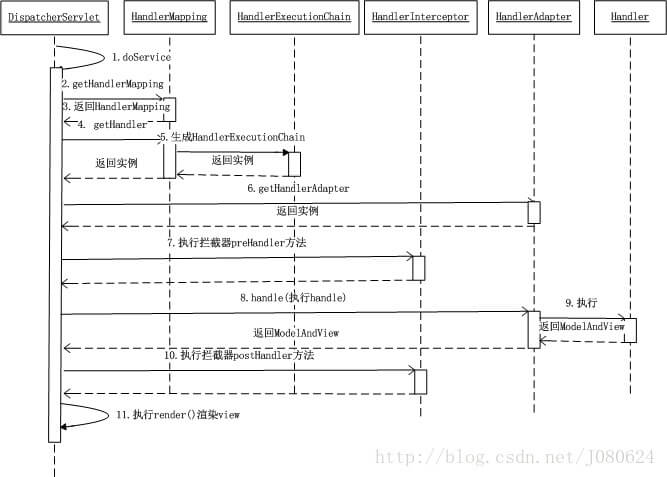
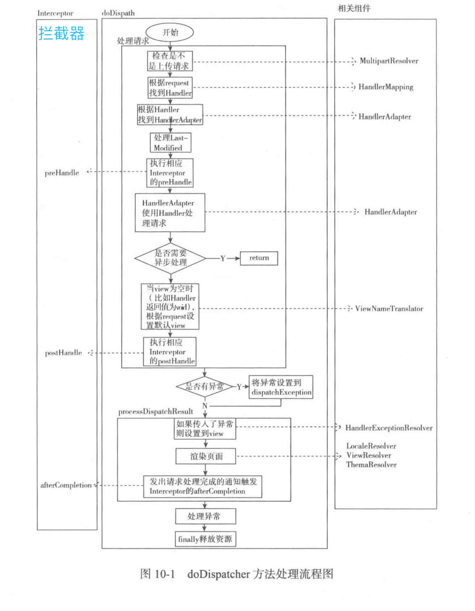

# 1. DispatcherServlet 的工作流程

总体流程图：


### 1.1 发送请求

> 用户向服务器发送 HTTP 请求，请求被 Spring MVC 的调度控制器 DispatcherServlet 捕获。

### 1.2 映射处理器

> DispatcherServlet 根据请求 URL ，调用 HandlerMapping 获得该 Handler 配置的所有相关的对象（包括 Handler 对象以及 Handler 对象对应的拦截器），最后以 HandlerExecutionChain 对象的形式返回。

### 1.3 处理器适配

> DispatcherServlet 根据获得的 Handler，选择一个合适的HandlerAdapter 。（附注：如果成功获得 HandlerAdapter 后，此时将开始执行拦截器的 #preHandler(...) 方法）。

提取请求 Request 中的模型数据，填充 Handler 入参，开始执行Handler（Controller)。 在填充Handler的入参过程中，根据你的配置，Spring 将帮你做一些额外的工作：

- HttpMessageConverter ：会将请求消息（如 JSON、XML 等数据）转换成一个对象。
- 数据转换：对请求消息进行数据转换。如 String 转换成 Integer、Double 等。
- 数据格式化：对请求消息进行数据格式化。如将字符串转换成格式化数字或格式化日期等。
- 数据验证： 验证数据的有效性（长度、格式等），验证结果存储到 BindingResult 或 Error 中。

Handler(Controller) 执行完成后，向 DispatcherServlet 返回一个 ModelAndView 对象。

### 1.4 解析视图

根据返回的 ModelAndView ，选择一个适合的 ViewResolver（必须是已经注册到 Spring 容器中的 ViewResolver)，解析出 View 对象，然后返回给 DispatcherServlet。

### 1.5 渲染视图 + 响应请求

ViewResolver 结合 Model 和 View，来渲染视图，并写回给用户( 浏览器 )。

但是 Spring MVC 的流程真的一定是酱紫么？

既然这么问，答案当然不是。对于目前主流的架构，前后端已经进行分离了，所以 Spring MVC 只负责 Model 和 Controller 两块，而将 View 移交给了前端。

那么变成什么样了呢？在步骤1.3中，如果 Handler(Controller) 执行完后，如果判断方法有 @ResponseBody 注解，则直接将结果写回给用户( 浏览器 )。

> 但是 HTTP 是不支持返回 Java POJO 对象的，所以需要将结果使用 HttpMessageConverter 进行转换后，才能返回。例如说，大家所熟悉的 FastJsonHttpMessageConverter ，将 POJO 转换成 JSON 字符串返回。

流程示意图：


代码序列图：



流程示意图：


# 2. 注解的作用

## 2.1 @Controller 注解有什么用？

@Controller 注解，它将一个类标记为 Spring Web MVC 控制器 Controller 。

## 2.2 @RestController 和 @Controller 有什么区别？

@RestController 注解，在 @Controller 基础上，增加了 @ResponseBody 注解，更加适合目前前后端分离的架构下，提供 Restful API ，返回例如 JSON 数据格式。当然，返回什么样的数据格式，根据客户端的 "ACCEPT" 请求头来决定。

## 2.3 @RequestMapping 注解有什么用？

@RequestMapping 注解，用于将特定 HTTP 请求方法映射到将处理相应请求的控制器中的特定类/方法。此注释可应用于两个级别：

- 类级别：映射请求的 URL。
- 方法级别：映射 URL 以及 HTTP 请求方法。

## 2.4 @RequestMapping 和 @GetMapping 注解的不同之处在哪里？

- @RequestMapping 可注解在类和方法上；@GetMapping 仅可注册在方法上
- @RequestMapping 可进行 GET、POST、PUT、DELETE 等请求方法；@GetMapping 是 @RequestMapping 的 GET 请求方法的特例，目的是为了提高清晰度。

## 2.5 返回 JSON 格式使用什么注解？

可以使用 @ResponseBody 注解，或者使用包含 @ResponseBody 注解的 @RestController 注解。

当然，还是需要配合相应的支持 JSON 格式化的 HttpMessageConverter 实现类。例如，Spring MVC 默认使用 MappingJackson2HttpMessageConverter 。

# 3. 介绍一下 WebApplicationContext ？

WebApplicationContext 是实现ApplicationContext接口的子类，专门为 WEB 应用准备的。

- 它允许从相对于 Web 根目录的路径中加载配置文件，完成初始化 Spring MVC 组件的工作。

- 从 WebApplicationContext 中，可以获取 ServletContext 引用，整个 Web 应用上下文对象将作为属性放置在 ServletContext 中，以便 Web 应用环境可以访问 Spring 上下文。

# 4. Spring MVC 的异常处理？

Spring MVC 提供了异常解析器 HandlerExceptionResolver 接口，将处理器( handler )执行时发生的异常，解析( 转换 )成对应的 ModelAndView 结果。代码如下：

```$java
// HandlerExceptionResolver.java

public interface HandlerExceptionResolver {

    /**
     * 解析异常，转换成对应的 ModelAndView 结果
     */
    @Nullable
    ModelAndView resolveException(
            HttpServletRequest request, HttpServletResponse response, @Nullable Object handler, Exception ex);

}
```

也就是说，如果异常被解析成功，则会返回 ModelAndView 对象。

# 5. Spring MVC 有什么优点？

1. 使用真的真的真的非常方便，无论是添加 HTTP 请求方法映射的方法，还是不同数据格式的响应。
2. 提供拦截器机制，可以方便的对请求进行拦截处理。
3. 提供异常机制，可以方便的对异常做统一处理。
4. 可以任意使用各种视图技术，而不仅仅局限于 JSP ，例如 Freemarker、Thymeleaf 等等。
不依赖于 Servlet API (目标虽是如此，但是在实现的时候确实是依赖于 Servlet 的，当然仅仅依赖 Servlet ，而不依赖 Filter、Listener )。

# 6. Spring MVC 怎样设定重定向和转发 ？

- 结果转发：在返回值的前面加 "forward:/" 。
- 重定向：在返回值的前面加上 "redirect:/" 。

# 7. 详细介绍下 Spring MVC 拦截器？

org.springframework.web.servlet.HandlerInterceptor ，拦截器接口。

```$java
// HandlerInterceptor.java

/**
 * 拦截处理器，在 {@link HandlerAdapter#handle(HttpServletRequest, HttpServletResponse, Object)} 执行之前
 */
default boolean preHandle(HttpServletRequest request, HttpServletResponse response, Object handler)
		throws Exception {
	return true;
}

/**
 * 拦截处理器，在 {@link HandlerAdapter#handle(HttpServletRequest, HttpServletResponse, Object)} 执行成功之后
 */
default void postHandle(HttpServletRequest request, HttpServletResponse response, Object handler,
		@Nullable ModelAndView modelAndView) throws Exception {
}

/**
 * 拦截处理器，在 {@link HandlerAdapter#handle(HttpServletRequest, HttpServletResponse, Object)} 执行完之后，无论成功还是失败
 *
 * 并且，只有该处理器 {@link #preHandle(HttpServletRequest, HttpServletResponse, Object)} 执行成功之后，才会被执行
 */
default void afterCompletion(HttpServletRequest request, HttpServletResponse response, Object handler,
		@Nullable Exception ex) throws Exception {
}
```

一共有三个方法，分别为：
- preHandle(...) 方法，调用 Controller 方法之前执行。
- postHandle(...) 方法，调用 Controller 方法之后执行。
- afterCompletion(...) 方法，处理完 Controller 方法返回结果之后执行。

举个例子：

- 俩个拦截器都实现放行操作时，执行顺序为 preHandle[1] => preHandle[2] => postHandle[2] => postHandle[1] => afterCompletion[2] => afterCompletion[1] 。
- 当第一个拦截器 #preHandle(...) 方法返回 false ，也就是对其进行拦截时，第二个拦截器是完全不执行的，第一个拦截器只执行 #preHandle(...) 部分。
- 当第一个拦截器 #preHandle(...) 方法返回 true ，第二个拦截器 #preHandle(...) 返回 false ，执行顺序为 preHandle[1] => preHandle[2] => afterCompletion[1] 。

总结来说：
- preHandle(...) 方法，按拦截器定义顺序调用。若任一拦截器返回 false ，则 Controller 方法不再调用。
- postHandle(...) 和 #afterCompletion(...) 方法，按拦截器定义逆序调用。
- postHandler(...) 方法，在调用 Controller 方法之后执行。
- afterCompletion(...) 方法，只有该拦截器在 #preHandle(...) 方法返回 true 时，才能够被调用，且一定会被调用。为什么“且一定会被调用”呢？即使 #afterCompletion(...) 方法，按拦截器定义逆序调用时，前面的拦截器发生异常，后面的拦截器还能够调用，即无视异常。

# 8. Spring MVC 的拦截器可以做哪些事情？

拦截器能做的事情非常非常非常多，例如：

- 记录访问日志。
- 记录异常日志。
- 要登陆的请求操作，拦截未登陆的用户。

# 9. Spring MVC 的拦截器和 Filter 过滤器有什么差别？

- 功能相同：拦截器和 Filter都能实现相应的功能，谁也不比谁强。
- 容器不同：拦截器构建在 Spring MVC 体系中；Filter 构建在 Servlet 容器之上。
- 使用便利性不同：拦截器提供了三个方法，分别在不同的时机执行；过滤器仅提供一个方法，当然也能实现拦截器的执行时机的效果，就是麻烦一些。

我们会发现，拓展性好的框架，都会提供相应的拦截器或过滤器机制，方便的我们做一些拓展。例如：

- Dubbo 的 Filter 机制。
- Spring Cloud Gateway 的 Filter 机制。
- Struts2 的拦截器机制。

# 10. REST

### 10.1 REST 代表着什么?

REST 代表着抽象状态转移，它是根据 HTTP 协议从客户端发送数据到服务端，例如：服务端的一本书可以以 XML 或 JSON 格式传递到客户端。

### 10.2 什么是安全的 REST 操作?

REST 接口是通过 HTTP 方法完成操作。

- 一些HTTP操作是安全的，如 GET 和 HEAD ，它不能在服务端修改资源
- 换句话说，PUT,POST 和 DELETE 是不安全的，因为他们能修改服务端的资源。

所以，是否安全的界限，在于是否修改服务端的资源。

### 10.3 什么是幂等操作? 为什么幂等操作如此重要?

有一些HTTP方法，如：GET，不管你使用多少次它都能产生相同的结果，在没有任何一边影响的情况下，发送多个 GET 请求到相同的URI 将会产生相同的响应结果。因此，这就是所谓幂等操作。

换句话说，POST方法不是幂等操作 ，因为如果发送多个 POST 请求，它将在服务端创建不同的资源。但是，假如你用PUT更新资源，它将是幂等操作。

甚至多个 PUT 请求被用来更新服务端资源，将得到相同的结果。你可以通过 Pluralsight 学习 HTTP Fundamentals 课程来了解 HTTP 协议和一般的 HTTP 的更多幂等操作。

### 10.4 REST 是可扩展的或说是协同的吗?

是的，REST 是可扩展的和可协作的。它既不托管一种特定的技术选择，也不定在客户端或者服务端。你可以用 Java, C++, Python, 或 JavaScript 来创建 RESTful Web 服务，也可以在客户端使用它们。

我建议你读一本关于REST接口的书来了解更多，如：RESTful Web Services 。
 
### 10.5 REST 用哪种 HTTP 方法呢?

REST 能用任何的 HTTP 方法，但是，最受欢迎的是：

- 用 GET 来检索服务端资源
- 用 POST 来创建服务端资源
- 用 PUT 来更新服务端资源
- 用 DELETE 来删除服务端资源。 

恰好，这四个操作，对上我们日常逻辑的 CRUD 操作。

### 10.6 删除的 HTTP 状态返回码是什么 ?

在删除成功之后，您的 REST API 应该返回什么状态代码，并没有严格的规则。它可以返回 200 或 204 没有内容。

一般来说，如果删除操作成功，响应主体为空，返回 204 。

如果删除请求成功且响应体不是空的，则返回 200 。

### 10.7 REST API 是无状态的吗?

是的，REST API 应该是无状态的，因为它是基于 HTTP 的，它也是无状态的。

REST API 中的请求应该包含处理它所需的所有细节。它不应该依赖于以前或下一个请求或服务器端维护的一些数据，例如会话。

REST 规范为使其无状态设置了一个约束，在设计 REST API 时，您应该记住这一点。

### 10.7 REST安全吗? 你能做什么来保护它?

安全是一个宽泛的术语。它可能意味着消息的安全性，这是通过认证和授权提供的加密或访问限制提供的。

REST 通常不是安全的，但是您可以通过使用 Spring Security 来保护它。

- 至少，你可以通过在 Spring Security 配置文件中使用 HTTP 来启用 HTTP Basic Auth 基本认证。
- 类似地，如果底层服务器支持 HTTPS ，你可以使用 HTTPS 公开 REST API 。

### 10.8 HttpMessageConverter 在 Spring REST 中代表什么?

HttpMessageConverter 是一种策略接口 ，它指定了一个转换器，它可以转换 HTTP 请求和响应。Spring REST 用这个接口转换 HTTP 响应到多种格式，例如：JSON 或 XML 。

每个 HttpMessageConverter 实现都有一种或几种相关联的MIME协议。Spring 使用 "Accept" 的标头来确定客户端所期待的内容类型。

然后，它将尝试找到一个注册的 HTTPMessageConverter ，它能够处理特定的内容类型，并使用它将响应转换成这种格式，然后再将其发送给客户端。

### 10.8 如何创建 HttpMessageConverter 的自定义实现来支持一种新的请求/响应？

我们仅需要创建自定义的 AbstractHttpMessageConverter 的实现，并使用 WebMvcConfigurerAdapter 的 #extendMessageConverters(List<HttpMessageConverter<?>> converters) 方法注中册它，该方法可以生成一种新的请求 / 响应类型。

### 10.9 @PathVariable 注解，在 Spring MVC 做了什么? 为什么 REST 在 Spring 中如此有用？

@PathVariable 注解，是 Spring MVC 中有用的注解之一，它允许您从 URI 读取值，比如查询参数。它在使用 Spring 创建 RESTful Web 服务时特别有用，因为在 REST 中，资源标识符是 URI 的一部分。

