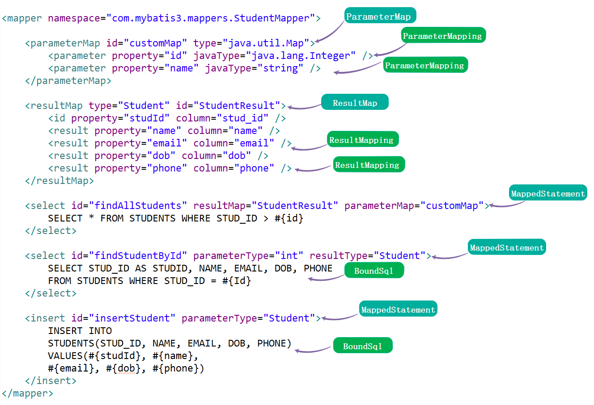

# MyBatis 初始化之加载 Mapper 映射配置文件

## 1. 概述

 MyBatis 初始化的第二步，加载 Mapper 映射配置文件。而这个步骤的入口是 XMLMapperBuilder 。
 
 
 
 XMLMapperBuilder.prase 解析Mapper.xml 里面的各种标签
 
 ## 2. XMLMapperBuilder
 
 org.apache.ibatis.builder.xml.XMLMapperBuilder ，继承 BaseBuilder 抽象类，Mapper XML 
 配置构建器，主要负责解析 Mapper 映射配置文件。 
 
 ## 3. MapperBuilderAssistant
 
 org.apache.ibatis.builder.MapperBuilderAssistant ，继承 BaseBuilder 抽象类，Mapper 构
 造器的小助手，提供了一些公用的方法，例如创建 ParameterMap、MappedStatement 对象等等。
 
 org.apache.ibatis.mapping.Discriminator
 
 org.apache.ibatis.mapping.ResultMapping 用来存放 resultMap 标签下的子元素
 
 org.apache.ibatis.mapping.ResultMap 用力存放 resultMap 标签的信息