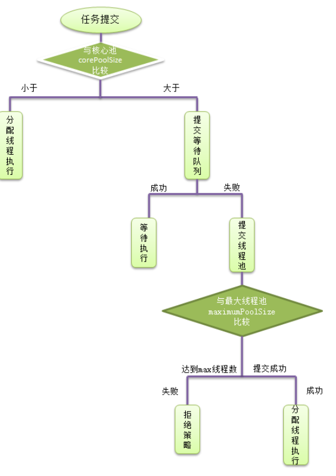
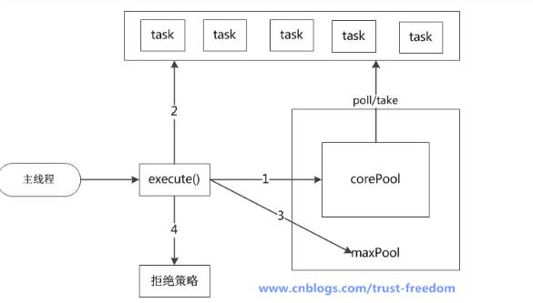
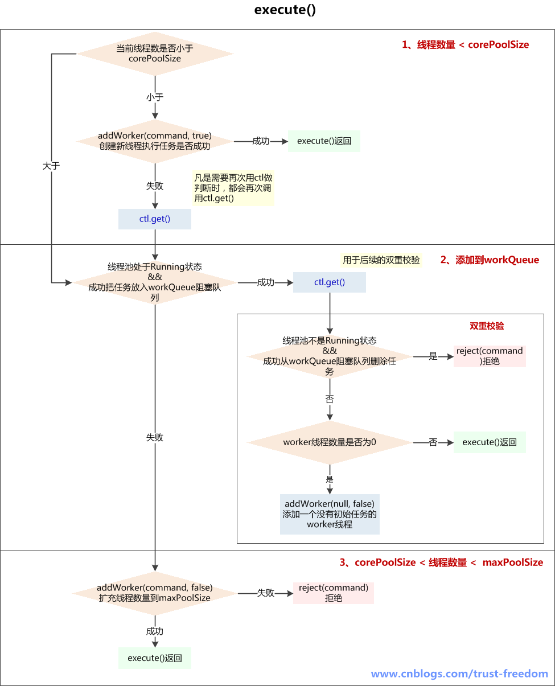
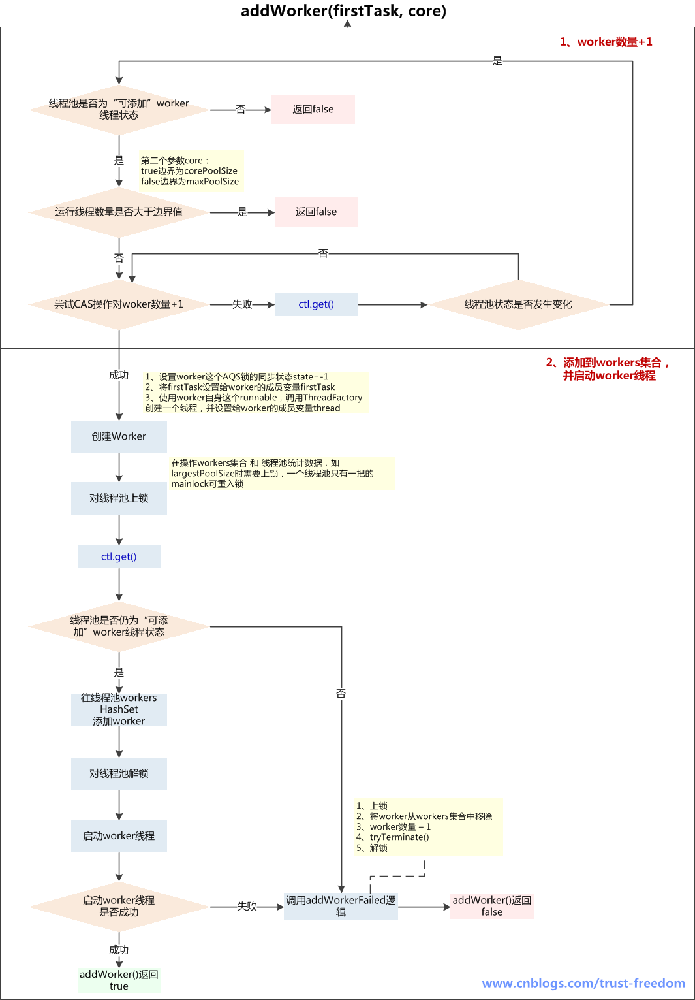
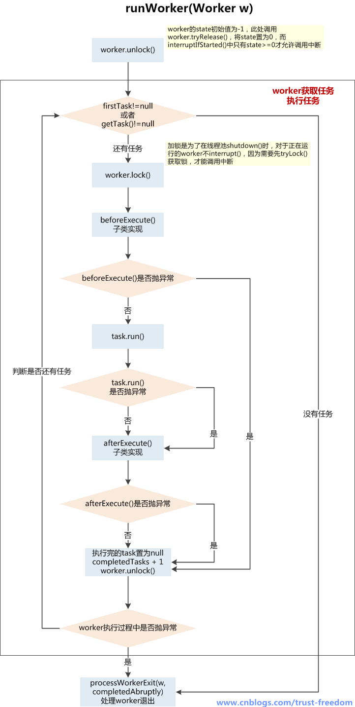
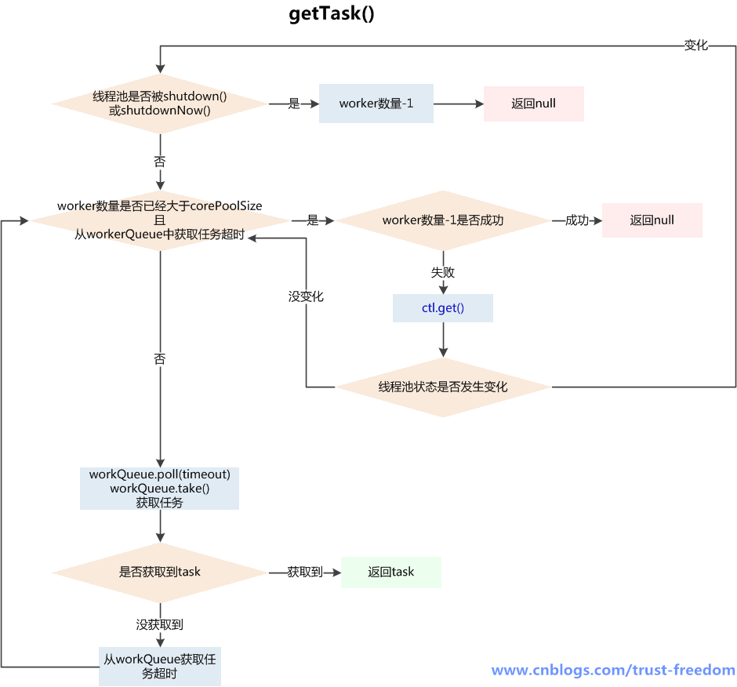

# 研读ThreadPoolExecutor

```$xslt
public ThreadPoolExecutor(int paramInt1, int paramInt2, long paramLong, TimeUnit paramTimeUnit,
            BlockingQueue<Runnable> paramBlockingQueue, ThreadFactory paramThreadFactory,
            RejectedExecutionHandler paramRejectedExecutionHandler) {
        this.ctl = new AtomicInteger(ctlOf(-536870912, 0));
        this.mainLock = new ReentrantLock();
        this.workers = new HashSet();
        this.termination = this.mainLock.newCondition();
        if ((paramInt1 < 0) || (paramInt2 <= 0) || (paramInt2 < paramInt1) || (paramLong < 0L))
            throw new IllegalArgumentException();
        if ((paramBlockingQueue == null) || (paramThreadFactory == null) || (paramRejectedExecutionHandler == null))
            throw new NullPointerException();
        this.corePoolSize = paramInt1;
        this.maximumPoolSize = paramInt2;
        this.workQueue = paramBlockingQueue;
        this.keepAliveTime = paramTimeUnit.toNanos(paramLong);
        this.threadFactory = paramThreadFactory;
        this.handler = paramRejectedExecutionHandler;
    }
```
corePoolSize :线程池的核心池大小，在创建线程池之后，线程池默认没有任何线程。

当有任务过来的时候才会去创建创建线程执行任务。换个说法，线程池创建之后，线程池中的线程数为0，当任务过来就会创建一个线程去执行，直到线程数达到corePoolSize 之后，就会被到达的任务放在队列中。（注意是到达的任务）。换句更精炼的话：corePoolSize 表示允许线程池中允许同时运行的最大线程数。

如果执行了线程池的prestartAllCoreThreads()方法，线程池会提前创建并启动所有核心线程。

maximumPoolSize :线程池允许的最大线程数，他表示最大能创建多少个线程。maximumPoolSize肯定是大于等于corePoolSize。

keepAliveTime :表示线程没有任务时最多保持多久然后停止。默认情况下，只有线程池中线程数大于corePoolSize 时，keepAliveTime 才会起作用。换句话说，当线程池中的线程数大于corePoolSize，并且一个线程空闲时间达到了keepAliveTime，那么就是shutdown。

Unit:keepAliveTime 的单位。

workQueue ：一个阻塞队列，用来存储等待执行的任务，当线程池中的线程数超过它的corePoolSize的时候，线程会进入阻塞队列进行阻塞等待。通过workQueue，线程池实现了阻塞功能

threadFactory ：线程工厂，用来创建线程。

handler :表示当拒绝处理任务时的策略。

任务缓存队列

在前面我们多次提到了任务缓存队列，即workQueue，它用来存放等待执行的任务。

workQueue的类型为BlockingQueue<Runnable>，通常可以取下面三种类型：

1）有界任务队列ArrayBlockingQueue：基于数组的先进先出队列，此队列创建时必须指定大小；

2）无界任务队列LinkedBlockingQueue：基于链表的先进先出队列，如果创建时没有指定此队列大小，则默认为Integer.MAX_VALUE；

3）直接提交队列synchronousQueue：这个队列比较特殊，它不会保存提交的任务，而是将直接新建一个线程来执行新来的任务。

拒绝策略
AbortPolicy:丢弃任务并抛出RejectedExecutionException

CallerRunsPolicy：只要线程池未关闭，该策略直接在调用者线程中，运行当前被丢弃的任务。显然这样做不会真的丢弃任务，但是，任务提交线程的性能极有可能会急剧下降。

DiscardOldestPolicy：丢弃队列中最老的一个请求，也就是即将被执行的一个任务，并尝试再次提交当前任务。

DiscardPolicy：丢弃任务，不做任何处理。

线程池的任务处理策略：
如果当前线程池中的线程数目小于corePoolSize，则每来一个任务，就会创建一个线程去执行这个任务；

如果当前线程池中的线程数目>=corePoolSize，则每来一个任务，会尝试将其添加到任务缓存队列当中，若添加成功，则该任务会等待空闲线程将其取出去执行；若添加失败（一般来说是任务缓存队列已满），则会尝试创建新的线程去执行这个任务；如果当前线程池中的线程数目达到maximumPoolSize，则会采取任务拒绝策略进行处理；

如果线程池中的线程数量大于 corePoolSize时，如果某线程空闲时间超过keepAliveTime，线程将被终止，直至线程池中的线程数目不大于corePoolSize；如果允许为核心池中的线程设置存活时间，那么核心池中的线程空闲时间超过keepAliveTime，线程也会被终止。

线程池的关闭

ThreadPoolExecutor提供了两个方法，用于线程池的关闭，分别是shutdown()和shutdownNow()，其中：

shutdown()：不会立即终止线程池，而是要等所有任务缓存队列中的任务都执行完后才终止，但再也不会接受新的任务

shutdownNow()：立即终止线程池，并尝试打断正在执行的任务，并且清空任务缓存队列，返回尚未执行的任务

源码分析
首先来看最核心的execute方法，这个方法在AbstractExecutorService中并没有实现，从Executor接口，直到ThreadPoolExecutor才实现了改方法，

ExecutorService中的submit(),invokeAll(),invokeAny()都是调用的execute方法，所以execute是核心中的核心,源码分析将围绕它逐步展开。
```$xslt
public void execute(Runnable command) {
        if (command == null)
            throw new NullPointerException();
        /*
         * Proceed in 3 steps:
         *
         * 1. If fewer than corePoolSize threads are running, try to
         * start a new thread with the given command as its first
         * task.  The call to addWorker atomically checks runState and
         * workerCount, and so prevents false alarms that would add
         * threads when it shouldn't, by returning false.
         * 如果正在运行的线程数小于corePoolSize，那么将调用addWorker 方法来创建一个新的线程，并将该任务作为新线程的第一个任务来执行。
　　　　　　 当然，在创建线程之前会做原子性质的检查，如果条件不允许，则不创建线程来执行任务，并返回false.　　

         * 2. If a task can be successfully queued, then we still need
         * to double-check whether we should have added a thread
         * (because existing ones died since last checking) or that
         * the pool shut down since entry into this method. So we
         * recheck state and if necessary roll back the enqueuing if
         * stopped, or start a new thread if there are none.
         * 如果一个任务成功进入阻塞队列，那么我们需要进行一个双重检查来确保是我们已经添加一个线程（因为存在着一些线程在上次检查后他已经死亡）或者
　　　　　　 当我们进入该方法时，该线程池已经关闭。所以，我们将重新检查状态，线程池关闭的情况下则回滚入队列，线程池没有线程的情况则创建一个新的线程。
         * 3. If we cannot queue task, then we try to add a new
         * thread.  If it fails, we know we are shut down or saturated
         * and so reject the task.
　　　　　　 如果任务无法入队列（队列满了），那么我们将尝试新开启一个线程（从corepoolsize到扩充到maximum），如果失败了，那么可以确定原因，要么是
　　　　　　 线程池关闭了或者饱和了（达到maximum），所以我们执行拒绝策略。

         */
　　　　
　　　　// 1.当前线程数量小于corePoolSize，则创建并启动线程。
        int c = ctl.get();
        if (workerCountOf(c) < corePoolSize) {
            if (addWorker(command, true))
　　　　　　　　// 成功，则返回

return;
            c = ctl.get();
        }
　　　　// 2.步骤1失败，则尝试进入阻塞队列，
        if (isRunning(c) && workQueue.offer(command)) {
　　　　　　　// 入队列成功，检查线程池状态，如果状态部署RUNNING而且remove成功，则拒绝任务
            int recheck = ctl.get();
            if (! isRunning(recheck) && remove(command))
                reject(command);
　　　　　　　// 如果当前worker数量为0，通过addWorker(null, false)创建一个线程，其任务为null
            else if (workerCountOf(recheck) == 0)
                addWorker(null, false);
        }
　　　　// 3. 步骤1和2失败，则尝试将线程池的数量有corePoolSize扩充至maxPoolSize，如果失败，则拒绝任务
        else if (!addWorker(command, false))
            reject(command);
    }
```


结合上面的流程图来逐行解析，首先前面进行空指针检查，

wonrkerCountOf()方法能够取得当前线程池中的线程的总数，取得当前线程数与核心池大小比较，

- 如果小于，将通过addWorker()方法调度执行。
- 如果大于核心池大小，那么就提交到等待队列。
- 如果进入等待队列失败，则会将任务直接提交给线程池。
- 如果线程数达到最大线程数，那么就提交失败，执行拒绝策略。

```$xslt
private boolean addWorker(Runnable firstTask, boolean core) {
        retry:
　　　　 // 外层循环，用于判断线程池状态
        for (;;) {
            int c = ctl.get();
            int rs = runStateOf(c);

            // Check if queue empty only if necessary.
            if (rs >= SHUTDOWN &&
                ! (rs == SHUTDOWN &&
                   firstTask == null &&
                   ! workQueue.isEmpty()))
                return false;
　　　　　　 // 内层的循环，任务是将worker数量加1
            for (;;) {
                int wc = workerCountOf(c);
                if (wc >= CAPACITY ||
                    wc >= (core ? corePoolSize : maximumPoolSize))
                    return false;
                if (compareAndIncrementWorkerCount(c))
                    break retry;
                c = ctl.get();  // Re-read ctl
                if (runStateOf(c) != rs)
                    continue retry;
                // else CAS failed due to workerCount change; retry inner loop
            }
        }
　　　　// worker加1后，接下来将woker添加到HashSet<Worker>中，并启动worker
        boolean workerStarted = false;
        boolean workerAdded = false;
        Worker w = null;
        try {
            final ReentrantLock mainLock = this.mainLock;
            w = new Worker(firstTask);
            final Thread t = w.thread;
            if (t != null) {
                mainLock.lock();
                try {
                    // Recheck while holding lock.
                    // Back out on ThreadFactory failure or if
                    // shut down before lock acquired.
                    int c = ctl.get();
                    int rs = runStateOf(c);

                    if (rs < SHUTDOWN ||
                        (rs == SHUTDOWN && firstTask == null)) {
                        if (t.isAlive()) // precheck that t is startable
                            throw new IllegalThreadStateException();
                        workers.add(w);
                        int s = workers.size();
                        if (s > largestPoolSize)
                            largestPoolSize = s;
                        workerAdded = true;
                    }
                } finally {
                    mainLock.unlock();
                }
　　　　　　　　　// 如果往HashSet<Worker>添加成功，则启动该线程
                if (workerAdded) {
                    t.start();
                    workerStarted = true;
                }
            }
        } finally {
            if (! workerStarted)
                addWorkerFailed(w);
        }
        return workerStarted;
    }
```

addWorker(Runnable firstTask, boolean core)的主要任务是创建并启动线程。

他会根据当前线程的状态和给定的值（core or maximum）来判断是否可以创建一个线程。

addWorker共有四种传参方式。execute使用了其中三种，分别为:

1.addWorker(paramRunnable, true)

线程数小于corePoolSize时，放一个需要处理的task进Workers Set。如果Workers Set长度超过corePoolSize，就返回false.

2.addWorker(null, false)

放入一个空的task进workers Set，长度限制是maximumPoolSize。这样一个task为空的worker在线程执行的时候会去任务队列里拿任务，这样就相当于创建了一个新的线程，只是没有马上分配任务。

3.addWorker(paramRunnable, false)

当队列被放满时，就尝试将这个新来的task直接放入Workers Set，而此时Workers Set的长度限制是maximumPoolSize。如果线程池也满了的话就返回false.

 

还有一种情况是execute()方法没有使用的

addWorker(null, true)

这个方法就是放一个null的task进Workers Set，而且是在小于corePoolSize时，如果此时Set中的数量已经达到corePoolSize那就返回false，什么也不干。实际使用中是在prestartAllCoreThreads()方法，这个方法用来为线程池预先启动corePoolSize个worker等待从workQueue中获取任务执行。

执行流程：

1、判断线程池当前是否为可以添加worker线程的状态，可以则继续下一步，不可以return false：
    A、线程池状态>shutdown，可能为stop、tidying、terminated，不能添加worker线程
    B、线程池状态==shutdown，firstTask不为空，不能添加worker线程，因为shutdown状态的线程池不接收新任务
    C、线程池状态==shutdown，firstTask==null，workQueue为空，不能添加worker线程，因为firstTask为空是为了添加一个没有任务的线程再从workQueue获取task，而workQueue为  　　　　空，说明添加无任务线程已经没有意义
2、线程池当前线程数量是否超过上限（corePoolSize 或 maximumPoolSize），超过了return false，没超过则对workerCount+1，继续下一步
3、在线程池的ReentrantLock保证下，向Workers Set中添加新创建的worker实例，添加完成后解锁，并启动worker线程，如果这一切都成功了，return true，如果添加worker入Set失败或启动失败，调用addWorkerFailed()逻辑



1、如果线程池中的线程数量少于corePoolSize，就创建新的线程来执行新添加的任务
2、如果线程池中的线程数量大于等于corePoolSize，但队列workQueue未满，则将新添加的任务放到workQueue中
3、如果线程池中的线程数量大于等于corePoolSize，且队列workQueue已满，但线程池中的线程数量小于maximumPoolSize，则会创建新的线程来处理被添加的任务
4、如果线程池中的线程数量等于了maximumPoolSize，就用RejectedExecutionHandler来执行拒绝策略

二、线程池状态
```$xslt
private final AtomicInteger ctl = new AtomicInteger(ctlOf(RUNNING, 0));
private static final int COUNT_BITS = Integer.SIZE - 3;
private static final int CAPACITY   = (1 << COUNT_BITS) - 1;
 
// runState is stored in the high-order bits
private static final int RUNNING    = -1 << COUNT_BITS;
private static final int SHUTDOWN   =  0 << COUNT_BITS;
private static final int STOP       =  1 << COUNT_BITS;
private static final int TIDYING    =  2 << COUNT_BITS;
private static final int TERMINATED =  3 << COUNT_BITS;
 
// Packing and unpacking ctl
private static int runStateOf(int c)     { return c & ~CAPACITY; }
private static int workerCountOf(int c)  { return c & CAPACITY; }
private static int ctlOf(int rs, int wc) { return rs | wc; }
```
其中ctl这个AtomicInteger的功能很强大，其高3位用于维护线程池运行状态，低29位维护线程池中线程数量

1、RUNNING：-1<<COUNT_BITS，即高3位为1，低29位为0，该状态的线程池会接收新任务，也会处理在阻塞队列中等待处理的任务

2、SHUTDOWN：0<<COUNT_BITS，即高3位为0，低29位为0，该状态的线程池不会再接收新任务，但还会处理已经提交到阻塞队列中等待处理的任务

3、STOP：1<<COUNT_BITS，即高3位为001，低29位为0，该状态的线程池不会再接收新任务，不会处理在阻塞队列中等待的任务，而且还会中断正在运行的任务

4、TIDYING：2<<COUNT_BITS，即高3位为010，低29位为0，所有任务都被终止了，workerCount为0，为此状态时还将调用terminated()方法

5、TERMINATED：3<<COUNT_BITS，即高3位为100，低29位为0，terminated()方法调用完成后变成此状态

这些状态均由int型表示，大小关系为 RUNNING<SHUTDOWN<STOP<TIDYING<TERMINATED，这个顺序基本上也是遵循线程池从 运行 到 终止这个过程。

 

runStateOf(int c)  方法：c & 高3位为1，低29位为0的~CAPACITY，用于获取高3位保存的线程池状态

workerCountOf(int c)方法：c & 高3位为0，低29位为1的CAPACITY，用于获取低29位的线程数量

ctlOf(int rs, int wc)方法：参数rs表示runState，参数wc表示workerCount，即根据runState和workerCount打包合并成ctl

## 三、任务提交内部原理
1、execute()  --  提交任务

```$xslt
/**
 * Executes the given task sometime in the future.  The task
 * may execute in a new thread or in an existing pooled thread.
 * 在未来的某个时刻执行给定的任务。这个任务用一个新线程执行，或者用一个线程池中已经存在的线程执行
 *
 * If the task cannot be submitted for execution, either because this
 * executor has been shutdown or because its capacity has been reached,
 * the task is handled by the current {@code RejectedExecutionHandler}.
 * 如果任务无法被提交执行，要么是因为这个Executor已经被shutdown关闭，要么是已经达到其容量上限，任务会被当前的RejectedExecutionHandler处理
 *
 * @param command the task to execute
 * @throws RejectedExecutionException at discretion of
 *         {@code RejectedExecutionHandler}, if the task
 *         cannot be accepted for execution                 RejectedExecutionException是一个RuntimeException
 * @throws NullPointerException if {@code command} is null
 */
public void execute(Runnable command) {
    if (command == null)
        throw new NullPointerException();
     
    /*
     * Proceed in 3 steps:
     *
     * 1. If fewer than corePoolSize threads are running, try to
     * start a new thread with the given command as its first
     * task.  The call to addWorker atomically checks runState and
     * workerCount, and so prevents false alarms that would add
     * threads when it shouldn't, by returning false.
     * 如果运行的线程少于corePoolSize，尝试开启一个新线程去运行command，command作为这个线程的第一个任务
     *
     * 2. If a task can be successfully queued, then we still need
     * to double-check whether we should have added a thread
     * (because existing ones died since last checking) or that
     * the pool shut down since entry into this method. So we
     * recheck state and if necessary roll back the enqueuing if
     * stopped, or start a new thread if there are none.
     * 如果任务成功放入队列，我们仍需要一个双重校验去确认是否应该新建一个线程（因为可能存在有些线程在我们上次检查后死了） 或者 从我们进入这个方法后，pool被关闭了
     * 所以我们需要再次检查state，如果线程池停止了需要回滚入队列，如果池中没有线程了，新开启 一个线程
     * 
     * 3. If we cannot queue task, then we try to add a new
     * thread.  If it fails, we know we are shut down or saturated
     * and so reject the task.
     * 如果无法将任务入队列（可能队列满了），需要新开区一个线程（自己：往maxPoolSize发展）
     * 如果失败了，说明线程池shutdown 或者 饱和了，所以我们拒绝任务
     */
    int c = ctl.get();
     
    /**
     * 1、如果当前线程数少于corePoolSize（可能是由于addWorker()操作已经包含对线程池状态的判断，如此处没加，而入workQueue前加了）
     */
    if (workerCountOf(c) < corePoolSize) {
        //addWorker()成功，返回
        if (addWorker(command, true))
            return;
         
        /**
         * 没有成功addWorker()，再次获取c（凡是需要再次用ctl做判断时，都会再次调用ctl.get()）
         * 失败的原因可能是：
         * 1、线程池已经shutdown，shutdown的线程池不再接收新任务
         * 2、workerCountOf(c) < corePoolSize 判断后，由于并发，别的线程先创建了worker线程，导致workerCount>=corePoolSize
         */
        c = ctl.get();
    }
     
    /**
     * 2、如果线程池RUNNING状态，且入队列成功
     */
    if (isRunning(c) && workQueue.offer(command)) {
        int recheck = ctl.get();//再次校验位
         
        /**
         * 再次校验放入workerQueue中的任务是否能被执行
         * 1、如果线程池不是运行状态了，应该拒绝添加新任务，从workQueue中删除任务
         * 2、如果线程池是运行状态，或者从workQueue中删除任务失败（刚好有一个线程执行完毕，并消耗了这个任务），确保还有线程执行任务（只要有一个就够了）
         */
        //如果再次校验过程中，线程池不是RUNNING状态，并且remove(command)--workQueue.remove()成功，拒绝当前command
        if (! isRunning(recheck) && remove(command))
            reject(command);
        //如果当前worker数量为0，通过addWorker(null, false)创建一个线程，其任务为null
        //为什么只检查运行的worker数量是不是0呢？？ 为什么不和corePoolSize比较呢？？
        //只保证有一个worker线程可以从queue中获取任务执行就行了？？
        //因为只要还有活动的worker线程，就可以消费workerQueue中的任务
        else if (workerCountOf(recheck) == 0)
            addWorker(null, false);  //第一个参数为null，说明只为新建一个worker线程，没有指定firstTask
                                     //第二个参数为true代表占用corePoolSize，false占用maxPoolSize
    }
    /**
     * 3、如果线程池不是running状态 或者 无法入队列
     *   尝试开启新线程，扩容至maxPoolSize，如果addWork(command, false)失败了，拒绝当前command
     */
    else if (!addWorker(command, false))
        reject(command);
}
```
execute(Runnable command)

参数：
    command    提交执行的任务，不能为空
执行流程：

1、如果线程池当前线程数量少于corePoolSize，则addWorker(command, true)创建新worker线程，如创建成功返回，如没创建成功，则执行后续步骤；
    addWorker(command, true)失败的原因可能是：
    A、线程池已经shutdown，shutdown的线程池不再接收新任务
    B、workerCountOf(c) < corePoolSize 判断后，由于并发，别的线程先创建了worker线程，导致workerCount>=corePoolSize
    
2、如果线程池还在running状态，将task加入workQueue阻塞队列中，如果加入成功，进行double-check，如果加入失败（可能是队列已满），则执行后续步骤；
    double-check主要目的是判断刚加入workQueue阻塞队列的task是否能被执行
    A、如果线程池已经不是running状态了，应该拒绝添加新任务，从workQueue中删除任务
    B、如果线程池是运行状态，或者从workQueue中删除任务失败（刚好有一个线程执行完毕，并消耗了这个任务），确保还有线程执行任务（只要有一个就够了）
    
3、如果线程池不是running状态 或者 无法入队列，尝试开启新线程，扩容至maxPoolSize，如果addWork(command, false)失败了，拒绝当前command

## 2、addWorker()  --  添加worker线程


```$xslt
/**
 * Checks if a new worker can be added with respect to current
 * pool state and the given bound (either core or maximum). If so,
 * the worker count is adjusted accordingly, and, if possible, a
 * new worker is created and started, running firstTask as its
 * first task. This method returns false if the pool is stopped or
 * eligible to shut down. It also returns false if the thread
 * factory fails to create a thread when asked.  If the thread
 * creation fails, either due to the thread factory returning
 * null, or due to an exception (typically OutOfMemoryError in
 * Thread#start), we roll back cleanly.
 * 检查根据当前线程池的状态和给定的边界(core or maximum)是否可以创建一个新的worker
 * 如果是这样的话，worker的数量做相应的调整，如果可能的话，创建一个新的worker并启动，参数中的firstTask作为worker的第一个任务
 * 如果方法返回false，可能因为pool已经关闭或者调用过了shutdown
 * 如果线程工厂创建线程失败，也会失败，返回false
 * 如果线程创建失败，要么是因为线程工厂返回null，要么是发生了OutOfMemoryError
 *
 * @param firstTask the task the new thread should run first (or
 * null if none). Workers are created with an initial first task
 * (in method execute()) to bypass(绕开) queuing when there are fewer
 * than corePoolSize threads (in which case we always start one),
 * or when the queue is full (in which case we must bypass queue).
 * Initially idle threads are usually created via
 * prestartCoreThread or to replace other dying workers.
 *
 * @param core if true use corePoolSize as bound, else
 * maximumPoolSize. (A boolean indicator is used here rather than a
 * value to ensure reads of fresh values after checking other pool
 * state).
 * @return true if successful
 */
private boolean addWorker(Runnable firstTask, boolean core) {
    //外层循环，负责判断线程池状态
    retry:
    for (;;) {
        int c = ctl.get();
        int rs = runStateOf(c); //状态
 
        // Check if queue empty only if necessary.
        /**
         * 线程池的state越小越是运行状态，runnbale=-1，shutdown=0,stop=1,tidying=2，terminated=3
         * 1、如果线程池state已经至少是shutdown状态了
         * 2、并且以下3个条件任意一个是false
         *   rs == SHUTDOWN         （隐含：rs>=SHUTDOWN）false情况： 线程池状态已经超过shutdown，可能是stop、tidying、terminated其中一个，即线程池已经终止
         *   firstTask == null      （隐含：rs==SHUTDOWN）false情况： firstTask不为空，rs==SHUTDOWN 且 firstTask不为空，return false，场景是在线程池已经shutdown后，还要添加新的任务，拒绝
         *   ! workQueue.isEmpty()  （隐含：rs==SHUTDOWN，firstTask==null）false情况： workQueue为空，当firstTask为空时是为了创建一个没有任务的线程，再从workQueue中获取任务，如果workQueue已经为空，那么就没有添加新worker线程的必要了
         * return false，即无法addWorker()
         */
        if (rs >= SHUTDOWN &&
            ! (rs == SHUTDOWN &&
               firstTask == null &&
               ! workQueue.isEmpty()))
            return false;
 
        //内层循环，负责worker数量+1
        for (;;) {
            int wc = workerCountOf(c); //worker数量
             
            //如果worker数量>线程池最大上限CAPACITY（即使用int低29位可以容纳的最大值）
            //或者( worker数量>corePoolSize 或  worker数量>maximumPoolSize )，即已经超过了给定的边界
            if (wc >= CAPACITY ||
                wc >= (core ? corePoolSize : maximumPoolSize))
                return false;
             
            //调用unsafe CAS操作，使得worker数量+1，成功则跳出retry循环
            if (compareAndIncrementWorkerCount(c))
                break retry;
             
            //CAS worker数量+1失败，再次读取ctl
            c = ctl.get();  // Re-read ctl
             
            //如果状态不等于之前获取的state，跳出内层循环，继续去外层循环判断
            if (runStateOf(c) != rs)
                continue retry;
            // else CAS failed due to workerCount change; retry inner loop
            // else CAS失败时因为workerCount改变了，继续内层循环尝试CAS对worker数量+1
        }
    }
 
    /**
     * worker数量+1成功的后续操作
     * 添加到workers Set集合，并启动worker线程
     */
    boolean workerStarted = false;
    boolean workerAdded = false;
    Worker w = null;
    try {
        final ReentrantLock mainLock = this.mainLock; 
        w = new Worker(firstTask); //1、设置worker这个AQS锁的同步状态state=-1
                                   //2、将firstTask设置给worker的成员变量firstTask
                                   //3、使用worker自身这个runnable，调用ThreadFactory创建一个线程，并设置给worker的成员变量thread
        final Thread t = w.thread;
        if (t != null) {
            mainLock.lock();
            try {
                //--------------------------------------------这部分代码是上锁的
                // Recheck while holding lock.
                // Back out on ThreadFactory failure or if
                // shut down before lock acquired.
                // 当获取到锁后，再次检查
                int c = ctl.get();
                int rs = runStateOf(c);
 
                //如果线程池在运行running<shutdown 或者 线程池已经shutdown，且firstTask==null（可能是workQueue中仍有未执行完成的任务，创建没有初始任务的worker线程执行）
                //worker数量-1的操作在addWorkerFailed()
                if (rs < SHUTDOWN ||
                    (rs == SHUTDOWN && firstTask == null)) {
                    if (t.isAlive()) // precheck that t is startable   线程已经启动，抛非法线程状态异常
                        throw new IllegalThreadStateException();
                     
                    workers.add(w);//workers是一个HashSet<Worker>
                     
                    //设置最大的池大小largestPoolSize，workerAdded设置为true
                    int s = workers.size();
                    if (s > largestPoolSize)
                        largestPoolSize = s;
                    workerAdded = true;
                }
              //--------------------------------------------
            } 
            finally {
                mainLock.unlock();
            }
             
            //如果往HashSet中添加worker成功，启动线程
            if (workerAdded) {
                t.start();
                workerStarted = true;
            }
        }
    } finally {
        //如果启动线程失败
        if (! workerStarted)
            addWorkerFailed(w);
    }
    return workerStarted;
}
```
addWorker(Runnable firstTask, boolean core)

参数：
    firstTask：    worker线程的初始任务，可以为空
    core：           true：将corePoolSize作为上限，false：将maximumPoolSize作为上限
addWorker方法有4种传参的方式：

    1、addWorker(command, true)

    2、addWorker(command, false)

    3、addWorker(null, false)

    4、addWorker(null, true)

在execute方法中就使用了前3种，结合这个核心方法进行以下分析

    第一个：线程数小于corePoolSize时，放一个需要处理的task进Workers Set。如果Workers Set长度超过corePoolSize，就返回false
    
    第二个：当队列被放满时，就尝试将这个新来的task直接放入Workers Set，而此时Workers Set的长度限制是maximumPoolSize。如果线程池也满了的话就返回false
    
    第三个：放入一个空的task进workers Set，长度限制是maximumPoolSize。这样一个task为空的worker在线程执行的时候会去任务队列里拿任务，这样就相当于创建了一个新的线程，只是没有马上分配任务
    
    第四个：这个方法就是放一个null的task进Workers Set，而且是在小于corePoolSize时，如果此时Set中的数量已经达到corePoolSize那就返回false，什么也不干。实际使用中是在prestartAllCoreThreads()方法，这个方法用来为线程池预先启动corePoolSize个worker等待从workQueue中获取任务执行
    
执行流程：

    1、判断线程池当前是否为可以添加worker线程的状态，可以则继续下一步，不可以return false：
    A、线程池状态>shutdown，可能为stop、tidying、terminated，不能添加worker线程
    B、线程池状态==shutdown，firstTask不为空，不能添加worker线程，因为shutdown状态的线程池不接收新任务
    C、线程池状态==shutdown，firstTask==null，workQueue为空，不能添加worker线程，因为firstTask为空是为了添加一个没有任务的线程再从workQueue获取task，而workQueue为空，说明添加无任务线程已经没有意义
    2、线程池当前线程数量是否超过上限（corePoolSize 或 maximumPoolSize），超过了return false，没超过则对workerCount+1，继续下一步
    
3、在线程池的ReentrantLock保证下，向Workers Set中添加新创建的worker实例，添加完成后解锁，并启动worker线程，如果这一切都成功了，return true，如果添加worker入Set失败或启动失败，调用addWorkerFailed()逻辑

## 3.内部类worker
```$xslt
/**
 * Class Worker mainly maintains interrupt control state for
 * threads running tasks, along with other minor bookkeeping.
 * This class opportunistically extends AbstractQueuedSynchronizer
 * to simplify acquiring and releasing a lock surrounding each
 * task execution.  This protects against interrupts that are
 * intended to wake up a worker thread waiting for a task from
 * instead interrupting a task being run.  We implement a simple
 * non-reentrant mutual exclusion lock rather than use
 * ReentrantLock because we do not want worker tasks to be able to
 * reacquire the lock when they invoke pool control methods like
 * setCorePoolSize.  Additionally, to suppress interrupts until
 * the thread actually starts running tasks, we initialize lock
 * state to a negative value, and clear it upon start (in
 * runWorker).
 * 
 * Worker类大体上管理着运行线程的中断状态 和 一些指标
 * Worker类投机取巧的继承了AbstractQueuedSynchronizer来简化在执行任务时的获取、释放锁
 * 这样防止了中断在运行中的任务，只会唤醒(中断)在等待从workQueue中获取任务的线程
 * 解释：
 *   为什么不直接执行execute(command)提交的command，而要在外面包一层Worker呢？？
 *   主要是为了控制中断
 *   用什么控制？？
 *   用AQS锁，当运行时上锁，就不能中断，TreadPoolExecutor的shutdown()方法中断前都要获取worker锁
 *   只有在等待从workQueue中获取任务getTask()时才能中断
 * worker实现了一个简单的不可重入的互斥锁，而不是用ReentrantLock可重入锁
 * 因为我们不想让在调用比如setCorePoolSize()这种线程池控制方法时可以再次获取锁(重入)
 * 解释：
 *   setCorePoolSize()时可能会interruptIdleWorkers()，在对一个线程interrupt时会要w.tryLock()
 *   如果可重入，就可能会在对线程池操作的方法中中断线程，类似方法还有：
 *   setMaximumPoolSize()
 *   setKeppAliveTime()
 *   allowCoreThreadTimeOut()
 *   shutdown()
 * 此外，为了让线程真正开始后才可以中断，初始化lock状态为负值(-1)，在开始runWorker()时将state置为0，而state>=0才可以中断
 * 
 * 
 * Worker继承了AQS，实现了Runnable，说明其既是一个可运行的任务，也是一把锁（不可重入）
 */
private final class Worker
    extends AbstractQueuedSynchronizer
    implements Runnable
{
    /**
     * This class will never be serialized, but we provide a
     * serialVersionUID to suppress a javac warning.
     */
    private static final long serialVersionUID = 6138294804551838833L;
 
    /** Thread this worker is running in.  Null if factory fails. */
    final Thread thread; //利用ThreadFactory和 Worker这个Runnable创建的线程对象
     
    /** Initial task to run.  Possibly null. */
    Runnable firstTask;
     
    /** Per-thread task counter */
    volatile long completedTasks;
 
    /**
     * Creates with given first task and thread from ThreadFactory.
     * @param firstTask the first task (null if none)
     */
    Worker(Runnable firstTask) {
        //设置AQS的同步状态private volatile int state，是一个计数器，大于0代表锁已经被获取
        setState(-1); // inhibit interrupts until runWorker 
                      // 在调用runWorker()前，禁止interrupt中断，在interruptIfStarted()方法中会判断 getState()>=0
        this.firstTask = firstTask;
        this.thread = getThreadFactory().newThread(this); //根据当前worker创建一个线程对象
                                                          //当前worker本身就是一个runnable任务，也就是不会用参数的firstTask创建线程，而是调用当前worker.run()时调用firstTask.run()
    }
 
    /** Delegates main run loop to outer runWorker  */
    public void run() {
        runWorker(this); //runWorker()是ThreadPoolExecutor的方法
    }
 
    // Lock methods
    //
    // The value 0 represents the unlocked state. 0代表“没被锁定”状态
    // The value 1 represents the locked state. 1代表“锁定”状态
 
    protected boolean isHeldExclusively() {
        return getState() != 0;
    }
 
    /**
     * 尝试获取锁
     * 重写AQS的tryAcquire()，AQS本来就是让子类来实现的
     */
    protected boolean tryAcquire(int unused) {
        //尝试一次将state从0设置为1，即“锁定”状态，但由于每次都是state 0->1，而不是+1，那么说明不可重入
        //且state==-1时也不会获取到锁
        if (compareAndSetState(0, 1)) {
            setExclusiveOwnerThread(Thread.currentThread()); //设置exclusiveOwnerThread=当前线程
            return true;
        }
        return false;
    }
 
    /**
     * 尝试释放锁
     * 不是state-1，而是置为0
     */
    protected boolean tryRelease(int unused) {
        setExclusiveOwnerThread(null); 
        setState(0);
        return true;
    }
 
    public void lock()        { acquire(1); }
    public boolean tryLock()  { return tryAcquire(1); }
    public void unlock()      { release(1); }
    public boolean isLocked() { return isHeldExclusively(); }
 
    /**
     * 中断（如果运行）
     * shutdownNow时会循环对worker线程执行
     * 且不需要获取worker锁，即使在worker运行时也可以中断
     */
    void interruptIfStarted() {
        Thread t;
        //如果state>=0、t!=null、且t没有被中断
        //new Worker()时state==-1，说明不能中断
        if (getState() >= 0 && (t = thread) != null && !t.isInterrupted()) {
            try {
                t.interrupt();
            } catch (SecurityException ignore) {
            }
        }
    }
}
```
Worker类
Worker类本身既实现了Runnable，又继承了AbstractQueuedSynchronizer（以下简称AQS），所以其既是一个可执行的任务，又可以达到锁的效果
new Worker()

    1、将AQS的state置为-1，在runWoker()前不允许中断
    2、待执行的任务会以参数传入，并赋予firstTask
    3、用Worker这个Runnable创建Thread

之所以Worker自己实现Runnable，并创建Thread，在firstTask外包一层，是因为要通过Worker控制中断，而firstTask这个工作任务只是负责执行业务
Worker控制中断主要有以下几方面：

1、初始AQS状态为-1，此时不允许中断interrupt()，只有在worker线程启动了，执行了runWoker()，将state置为0，才能中断
    不允许中断体现在：
    
    A、shutdown()线程池时，会对每个worker tryLock()上锁，而Worker类这个AQS的tryAcquire()方法是固定将state从0->1，故初始状态state==-1时tryLock()失败，没发interrupt()
    B、shutdownNow()线程池时，不用tryLock()上锁，但调用worker.interruptIfStarted()终止worker，interruptIfStarted()也有state>0才能interrupt的逻辑
    
2、为了防止某种情况下，在运行中的worker被中断，runWorker()每次运行任务时都会lock()上锁，而shutdown()这类可能会终止worker的操作需要先获取worker的锁，这样就防止了中断正在运行的线程

Worker实现的AQS为不可重入锁，为了是在获得worker锁的情况下再进入其它一些需要加锁的方法

Worker和Task的区别：
Worker是线程池中的线程，而Task虽然是runnable，但是并没有真正执行，只是被Worker调用了run方法，后面会看到这部分的实现。

## 4、runWorker()  --  执行任务

```$xslt
/**
 * Main worker run loop.  Repeatedly gets tasks from queue and
 * executes them, while coping with a number of issues:
 * 重复的从队列中获取任务并执行，同时应对一些问题：
 *
 * 1. We may start out with an initial task, in which case we
 * don't need to get the first one. Otherwise, as long as pool is
 * running, we get tasks from getTask. If it returns null then the
 * worker exits due to changed pool state or configuration
 * parameters.  Other exits result from exception throws in
 * external code, in which case completedAbruptly holds, which
 * usually leads processWorkerExit to replace this thread.
 * 我们可能使用一个初始化任务开始，即firstTask为null
 * 然后只要线程池在运行，我们就从getTask()获取任务
 * 如果getTask()返回null，则worker由于改变了线程池状态或参数配置而退出
 * 其它退出因为外部代码抛异常了，这会使得completedAbruptly为true，这会导致在processWorkerExit()方法中替换当前线程
 *
 * 2. Before running any task, the lock is acquired to prevent
 * other pool interrupts while the task is executing, and
 * clearInterruptsForTaskRun called to ensure that unless pool is
 * stopping, this thread does not have its interrupt set.
 * 在任何任务执行之前，都需要对worker加锁去防止在任务运行时，其它的线程池中断操作
 * clearInterruptsForTaskRun保证除非线程池正在stoping，线程不会被设置中断标示
 *
 * 3. Each task run is preceded by a call to beforeExecute, which
 * might throw an exception, in which case we cause thread to die
 * (breaking loop with completedAbruptly true) without processing
 * the task.
 * 每个任务执行前会调用beforeExecute()，其中可能抛出一个异常，这种情况下会导致线程die（跳出循环，且completedAbruptly==true），没有执行任务
 * 因为beforeExecute()的异常没有cache住，会上抛，跳出循环
 *
 * 4. Assuming beforeExecute completes normally, we run the task,
 * gathering any of its thrown exceptions to send to
 * afterExecute. We separately handle RuntimeException, Error
 * (both of which the specs guarantee that we trap) and arbitrary
 * Throwables.  Because we cannot rethrow Throwables within
 * Runnable.run, we wrap them within Errors on the way out (to the
 * thread's UncaughtExceptionHandler).  Any thrown exception also
 * conservatively causes thread to die.
 * 假定beforeExecute()正常完成，我们执行任务
 * 汇总任何抛出的异常并发送给afterExecute(task, thrown)
 * 因为我们不能在Runnable.run()方法中重新上抛Throwables，我们将Throwables包装到Errors上抛（会到线程的UncaughtExceptionHandler去处理）
 * 任何上抛的异常都会导致线程die
 *
 * 5. After task.run completes, we call afterExecute, which may
 * also throw an exception, which will also cause thread to
 * die. According to JLS Sec 14.20, this exception is the one that
 * will be in effect even if task.run throws.
 * 任务执行结束后，调用afterExecute()，也可能抛异常，也会导致线程die
 * 根据JLS Sec 14.20，这个异常（finally中的异常）会生效
 *
 * The net effect of the exception mechanics is that afterExecute
 * and the thread's UncaughtExceptionHandler have as accurate
 * information as we can provide about any problems encountered by
 * user code.
 *
 * @param w the worker
 */
final void runWorker(Worker w) {
    Thread wt = Thread.currentThread();
    Runnable task = w.firstTask;
    w.firstTask = null;
    w.unlock(); // allow interrupts
                // new Worker()是state==-1，此处是调用Worker类的tryRelease()方法，将state置为0， 而interruptIfStarted()中只有state>=0才允许调用中断
    boolean completedAbruptly = true; //是否“突然完成”，如果是由于异常导致的进入finally，那么completedAbruptly==true就是突然完成的
    try {
        /**
         * 如果task不为null，或者从阻塞队列中getTask()不为null
         */
        while (task != null || (task = getTask()) != null) {
            w.lock(); //上锁，不是为了防止并发执行任务，为了在shutdown()时不终止正在运行的worker
             
            // If pool is stopping, ensure thread is interrupted;
            // if not, ensure thread is not interrupted.  This
            // requires a recheck in second case to deal with
            // shutdownNow race while clearing interrupt
            /**
             * clearInterruptsForTaskRun操作
             * 确保只有在线程stoping时，才会被设置中断标示，否则清除中断标示
             * 1、如果线程池状态>=stop，且当前线程没有设置中断状态，wt.interrupt()
             * 2、如果一开始判断线程池状态<stop，但Thread.interrupted()为true，即线程已经被中断，又清除了中断标示，再次判断线程池状态是否>=stop
             *   是，再次设置中断标示，wt.interrupt()
             *   否，不做操作，清除中断标示后进行后续步骤
             */
            if ((runStateAtLeast(ctl.get(), STOP) ||
                 (Thread.interrupted() &&
                  runStateAtLeast(ctl.get(), STOP))) &&
                !wt.isInterrupted())
                wt.interrupt(); //当前线程调用interrupt()中断
             
            try {
                //执行前（子类实现）
                beforeExecute(wt, task);
                 
                Throwable thrown = null;
                try {
                    task.run();
                } 
                catch (RuntimeException x) {
                    thrown = x; throw x;
                } 
                catch (Error x) {
                    thrown = x; throw x;
                } 
                catch (Throwable x) {
                    thrown = x; throw new Error(x);
                } 
                finally {
                    //执行后（子类实现）
                    afterExecute(task, thrown); //这里就考验catch和finally的执行顺序了，因为要以thrown为参数
                }
            } 
            finally {
                task = null; //task置为null
                w.completedTasks++; //完成任务数+1
                w.unlock(); //解锁
            }
        }
         
        completedAbruptly = false;
    } 
    finally {
        //处理worker的退出
        processWorkerExit(w, completedAbruptly);
    }
}
```
runWorker(Worker w)

执行流程：

1、Worker线程启动后，通过Worker类的run()方法调用runWorker(this)

2、执行任务之前，首先worker.unlock()，将AQS的state置为0，允许中断当前worker线程

3、开始执行firstTask，调用task.run()，在执行任务前会上锁wroker.lock()，在执行完任务后会解锁，为了防止在任务运行时被线程池一些中断操作中断

4、在任务执行前后，可以根据业务场景自定义beforeExecute() 和 afterExecute()方法

5、无论在beforeExecute()、task.run()、afterExecute()发生异常上抛，都会导致worker线程终止，进入processWorkerExit()处理worker退出的流程

6、如正常执行完当前task后，会通过getTask()从阻塞队列中获取新任务，当队列中没有任务，且获取任务超时，那么当前worker也会进入退出流程

## 5、getTask()  --  获取任务

```$xslt
/**
 * Performs blocking or timed wait for a task, depending on
 * current configuration settings, or returns null if this worker
 * must exit because of any of:  以下情况会返回null
 * 1. There are more than maximumPoolSize workers (due to
 *    a call to setMaximumPoolSize).
 *    超过了maximumPoolSize设置的线程数量（因为调用了setMaximumPoolSize()）
 * 2. The pool is stopped.
 *    线程池被stop
 * 3. The pool is shutdown and the queue is empty.
 *    线程池被shutdown，并且workQueue空了
 * 4. This worker timed out waiting for a task, and timed-out
 *    workers are subject to termination (that is,
 *    {@code allowCoreThreadTimeOut || workerCount > corePoolSize})
 *    both before and after the timed wait.
 *    线程等待任务超时
 *
 * @return task, or null if the worker must exit, in which case
 *         workerCount is decremented
 *         返回null表示这个worker要结束了，这种情况下workerCount-1
 */
private Runnable getTask() {
    boolean timedOut = false; // Did the last poll() time out?
 
    /**
     * 外层循环
     * 用于判断线程池状态
     */
    retry:
    for (;;) {
        int c = ctl.get();
        int rs = runStateOf(c);
 
        // Check if queue empty only if necessary.
        /**
         * 对线程池状态的判断，两种情况会workerCount-1，并且返回null
         * 线程池状态为shutdown，且workQueue为空（反映了shutdown状态的线程池还是要执行workQueue中剩余的任务的）
         * 线程池状态为stop（shutdownNow()会导致变成STOP）（此时不用考虑workQueue的情况）
         */
        if (rs >= SHUTDOWN && (rs >= STOP || workQueue.isEmpty())) {
            decrementWorkerCount(); //循环的CAS减少worker数量，直到成功
            return null;
        }
 
        boolean timed;      // Are workers subject to culling?
                            // 是否需要定时从workQueue中获取
         
        /**
         * 内层循环
         * 要么break去workQueue获取任务
         * 要么超时了，worker count-1
         */
        for (;;) {
            int wc = workerCountOf(c);
            timed = allowCoreThreadTimeOut || wc > corePoolSize; //allowCoreThreadTimeOut默认为false
                                                                 //如果allowCoreThreadTimeOut为true，说明corePoolSize和maximum都需要定时
             
            //如果当前执行线程数<maximumPoolSize，并且timedOut 和 timed 任一为false，跳出循环，开始从workQueue获取任务
            if (wc <= maximumPoolSize && ! (timedOut && timed))
                break;
             
            /**
             * 如果到了这一步，说明要么线程数量超过了maximumPoolSize（可能maximumPoolSize被修改了）
             * 要么既需要计时timed==true，也超时了timedOut==true
             * worker数量-1，减一执行一次就行了，然后返回null，在runWorker()中会有逻辑减少worker线程
             * 如果本次减一失败，继续内层循环再次尝试减一
             */
            if (compareAndDecrementWorkerCount(c))
                return null;
             
            //如果减数量失败，再次读取ctl
            c = ctl.get();  // Re-read ctl
             
            //如果线程池运行状态发生变化，继续外层循环
            //如果状态没变，继续内层循环
            if (runStateOf(c) != rs)
                continue retry;
            // else CAS failed due to workerCount change; retry inner loop
        }
 
        try {
            //poll() - 使用  LockSupport.parkNanos(this, nanosTimeout) 挂起一段时间，interrupt()时不会抛异常，但会有中断响应
            //take() - 使用 LockSupport.park(this) 挂起，interrupt()时不会抛异常，但会有中断响应
            Runnable r = timed ?
                workQueue.poll(keepAliveTime, TimeUnit.NANOSECONDS) :    //大于corePoolSize
                workQueue.take();                                        //小于等于corePoolSize
             
            //如获取到了任务就返回
            if (r != null)
                return r;
             
            //没有返回，说明超时，那么在下一次内层循环时会进入worker count减一的步骤
            timedOut = true;
        } 
        /**
              * blockingQueue的take()阻塞使用LockSupport.park(this)进入wait状态的，对LockSupport.park(this)进行interrupt不会抛异常，但还是会有中断响应
              * 但AQS的ConditionObject的await()对中断状态做了判断，会报告中断状态 reportInterruptAfterWait(interruptMode)
              * 就会上抛InterruptedException，在此处捕获，重新开始循环
              * 如果是由于shutdown()等操作导致的空闲worker中断响应，在外层循环判断状态时，可能return null
              */
        catch (InterruptedException retry) { 
            timedOut = false; //响应中断，重新开始，中断状态会被清除
        }
    }
}
```
执行流程：

1、首先判断是否可以满足从workQueue中获取任务的条件，不满足return null

    A、线程池状态是否满足：
        （a）shutdown状态 + workQueue为空 或 stop状态，都不满足，因为被shutdown后还是要执行workQueue剩余的任务，但workQueue也为空，就可以退出了
        （b）stop状态，shutdownNow()操作会使线程池进入stop，此时不接受新任务，中断正在执行的任务，workQueue中的任务也不执行了，故return null返回
    B、线程数量是否超过maximumPoolSize 或 获取任务是否超时
        （a）线程数量超过maximumPoolSize可能是线程池在运行时被调用了setMaximumPoolSize()被改变了大小，否则已经addWorker()成功不会超过maximumPoolSize
        （b）如果 当前线程数量>corePoolSize，才会检查是否获取任务超时，这也体现了当线程数量达到maximumPoolSize后，如果一直没有新任务，会逐渐终止worker线程直到corePoolSize
        
2、如果满足获取任务条件，根据是否需要定时获取调用不同方法：

    A、workQueue.poll()：如果在keepAliveTime时间内，阻塞队列还是没有任务，返回null
    B、workQueue.take()：如果阻塞队列为空，当前线程会被挂起等待；当队列中有任务加入时，线程被唤醒，take方法返回任务
    
3、在阻塞从workQueue中获取任务时，可以被interrupt()中断，代码中捕获了InterruptedException，重置timedOut为初始值false，再次执行第1步中的判断，满足就继续获取任务，不满足return null，会进入worker退出的流程

## 6、processWorkerExit()  --  worker线程退出
```$xslt
/**
 * Performs cleanup and bookkeeping for a dying worker. Called
 * only from worker threads. Unless completedAbruptly is set,
 * assumes that workerCount has already been adjusted to account
 * for exit.  This method removes thread from worker set, and
 * possibly terminates the pool or replaces the worker if either
 * it exited due to user task exception or if fewer than
 * corePoolSize workers are running or queue is non-empty but
 * there are no workers.
 *
 * @param w the worker
 * @param completedAbruptly if the worker died due to user exception
 */
private void processWorkerExit(Worker w, boolean completedAbruptly) {
    /**
     * 1、worker数量-1
     * 如果是突然终止，说明是task执行时异常情况导致，即run()方法执行时发生了异常，那么正在工作的worker线程数量需要-1
     * 如果不是突然终止，说明是worker线程没有task可执行了，不用-1，因为已经在getTask()方法中-1了
     */
    if (completedAbruptly) // If abrupt, then workerCount wasn't adjusted 代码和注释正好相反啊
        decrementWorkerCount();
 
    /**
     * 2、从Workers Set中移除worker
     */
    final ReentrantLock mainLock = this.mainLock;
    mainLock.lock();
    try {
        completedTaskCount += w.completedTasks; //把worker的完成任务数加到线程池的完成任务数
        workers.remove(w); //从HashSet<Worker>中移除
    } finally {
        mainLock.unlock();
    }
 
    /**
     * 3、在对线程池有负效益的操作时，都需要“尝试终止”线程池
     * 主要是判断线程池是否满足终止的状态
     * 如果状态满足，但还有线程池还有线程，尝试对其发出中断响应，使其能进入退出流程
     * 没有线程了，更新状态为tidying->terminated
     */
    tryTerminate();
 
    /**
     * 4、是否需要增加worker线程
     * 线程池状态是running 或 shutdown
     * 如果当前线程是突然终止的，addWorker()
     * 如果当前线程不是突然终止的，但当前线程数量 < 要维护的线程数量，addWorker()
     * 故如果调用线程池shutdown()，直到workQueue为空前，线程池都会维持corePoolSize个线程，然后再逐渐销毁这corePoolSize个线程
     */
    int c = ctl.get();
    //如果状态是running、shutdown，即tryTerminate()没有成功终止线程池，尝试再添加一个worker
    if (runStateLessThan(c, STOP)) {
        //不是突然完成的，即没有task任务可以获取而完成的，计算min，并根据当前worker数量判断是否需要addWorker()
        if (!completedAbruptly) {
            int min = allowCoreThreadTimeOut ? 0 : corePoolSize; //allowCoreThreadTimeOut默认为false，即min默认为corePoolSize
             
            //如果min为0，即不需要维持核心线程数量，且workQueue不为空，至少保持一个线程
            if (min == 0 && ! workQueue.isEmpty())
                min = 1;
             
            //如果线程数量大于最少数量，直接返回，否则下面至少要addWorker一个
            if (workerCountOf(c) >= min)
                return; // replacement not needed
        }
         
        //添加一个没有firstTask的worker
        //只要worker是completedAbruptly突然终止的，或者线程数量小于要维护的数量，就新添一个worker线程，即使是shutdown状态
        addWorker(null, false);
    }
}
```

processWorkerExit(Worker w, boolean completedAbruptly)

参数：
    worker：                      要结束的worker
    completedAbruptly： 是否突然完成（是否因为异常退出）
    
执行流程：

1、worker数量-1

    A、如果是突然终止，说明是task执行时异常情况导致，即run()方法执行时发生了异常，那么正在工作的worker线程数量需要-1
    B、如果不是突然终止，说明是worker线程没有task可执行了，不用-1，因为已经在getTask()方法中-1了
    
2、从Workers Set中移除worker，删除时需要上锁mainlock

3、tryTerminate()：在对线程池有负效益的操作时，都需要“尝试终止”线程池，大概逻辑：
    判断线程池是否满足终止的状态
    
    A、如果状态满足，但还有线程池还有线程，尝试对其发出中断响应，使其能进入退出流程
    B、没有线程了，更新状态为tidying->terminated
    
4、是否需要增加worker线程，如果线程池还没有完全终止，仍需要保持一定数量的线程
    线程池状态是running 或 shutdown
    
    A、如果当前线程是突然终止的，addWorker()
    B、如果当前线程不是突然终止的，但当前线程数量 < 要维护的线程数量，addWorker()
    故如果调用线程池shutdown()，直到workQueue为空前，线程池都会维持corePoolSize个线程，然后再逐渐销毁这corePoolSize个线程

 


 